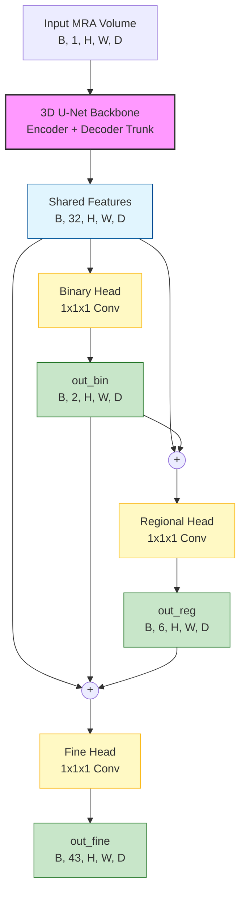

```mermaid
graph TD
    %% 1. 节点定义
    IN[Input MRA Volume<br/>B, 1, H, W, D]
    Backbone[3D U-Net Backbone<br/>Encoder + Decoder Trunk]
    SF[Shared Features<br/>B, 32, H, W, D]

    %% 2. 预测头定义
    HB[Binary Head<br/>1x1x1 Conv]
    HR[Regional Head<br/>1x1x1 Conv]
    HF[Fine Head<br/>1x1x1 Conv]

    %% 3. 输出定义
    OB[out_bin<br/>B, 2, H, W, D]
    OR[out_reg<br/>B, 6, H, W, D]
    OF[out_fine<br/>B, 43, H, W, D]

    %% 4. 级联逻辑 (Concatenation)
    C1((+))
    C2((+))

    %% 连接线路
    IN --> Backbone
    Backbone --> SF

    %% 分支1: Binary
    SF --> HB
    HB --> OB

    %% 分支2: Regional (Shared + Binary)
    SF --> C1
    OB --> C1
    C1 --> HR
    HR --> OR

    %% 分支3: Fine (Shared + Binary + Regional)
    SF --> C2
    OB --> C2
    OR --> C2
    C2 --> HF
    HF --> OF

    %% 5. 样式美化
    classDef backbone fill:#f9f,stroke:#333,stroke-width:2px;
    classDef feature fill:#e1f5fe,stroke:#01579b;
    classDef head fill:#fff9c4,stroke:#fbc02d;
    classDef output fill:#c8e6c9,stroke:#2e7d32;

    class Backbone backbone;
    class SF feature;
    class HB,HR,HF head;
    class OB,OR,OF output;
```